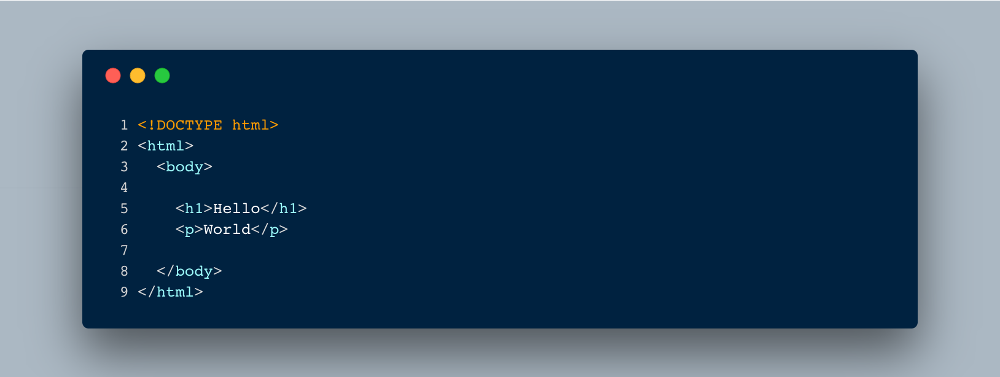

## The basis to work with

The first thing you have to know before you can develop a
successful web application is the platform you are running
on. The "Browser". Browsers are build to render HTML, a
xml-like language to describe a layout and information.

This image shows a very basic example of html code, which
shows a simple hello world message



[click here to see the rendered result](./hello-world.html)

It looks ugly, but this is the basis we are building upon.

To see a more advanced example, just open the dev tools (
<kbd>F12</kbd>, <kbd>⌘</kbd>+<kbd>⌥</kbd>+<kbd>i</kbd> ).
Besides a whole lot more content on the site in comparison
to the hello-world example, the most important differences
are two special html tags.

```html
<style />
```

and even more important

```html
<script />
```

with the style-tag it is possible to define css rules to
declare how different elements are displayed in the browser
and the script-tag enables us to execute JavaScript 🎉🎉🎉.
Having JavaScript on the page makes it possible to have
interactive elements or even generate new elements on the
site. For example: the following code snippet inserts a text
and an interactive button in the sample block below this
paragraph.

```js
function toggleColor() {
  var element = window.document.querySelector(
    "#toggle-target"
  );

  if (element) {
    element.style.color =
      element.style.color === "black" ? "red" : "black";
  }
}

var toggleText = document.createElement("div");
toggleText.textContent =
  "By pressing the button you can change the color of this text";
toggleText.id = "toggle-target";
toggleText.style.color = "black";
document.querySelector("#sample1").appendChild(toggleText);

var toggleButton = document.createElement("button");
toggleButton.textContent = "toggle";
toggleButton.onclick = toggleColor;
document
  .querySelector("#sample1")
  .appendChild(toggleButton);
```

<div style="border: 1px solid; padding: 8px;margin: 24px 0;" id="sample1"><b>Sample 1</b></div>

But wait! Generating dynamic pages is an old story, so what
is so great about WebApps?

Running completely in the browser, there is no need to
reload the complete UI after a change in the dataset. So it
can be faster, more responsive and it can even work offline.
Also it is a good practice of concerns to separate the
data-providers and API-servers from the user interface.

## Tooling

As you can see in the sample above it can be very clumsy and
unattractive to work with the low-level browser-apis.
Fortunately JavaScript has made a huge evolutionary jump in
the last years and writing code has become easier. The
drawback of this is the dependency of build-tools.

One of the most important ones is
[babeljs](https://babeljs.io). Babel is a JavaScript to
JavaScript compiler, translating new fancy features to older
standards which all browsers understand. Another big player
is [webpack](https://webpack.js.org/). It is a build tool to
create bundles of JavaScript containing only the relevant
parts and being executable in the browser. But as important
as those tools are they are encapsulated in most cases and
especially in the beginning it is not important to know
every detail. Nevertheless you need to be able to run the
tools and because they are all JavaScript based you need to
install [node.js](https://nodejs.org).

Node.js is a JavaScript runtime based on the Chrome's V8
engine. For development reasons always install the current
version, the long time support (LTS) version is relevant if
you want to use node as your server-software. With Node
comes also "npm", the node-package-manger and enormous
JavaScript [package registry](https://www.npmjs.com/).

Now you are able to run JavaScript files from your terminal,
but to write those you still need a development environment.
I highly recommend
[Visual Studio Code](https://code.visualstudio.com/) a free
and opensource IDE from Microsoft.

To begin the
[ESLint](https://marketplace.visualstudio.com/items?itemName=dbaeumer.vscode-eslint)
plugin and the
[Prettier](https://marketplace.visualstudio.com/items?itemName=esbenp.prettier-vscode)
plugin should be enough. ESLint is a tool to mark potential
errors and bad coding patterns, Prettier is a code formatter
for JavaScript, best combined with "format on save".

If not already known: For every work with code a versioning
system is very important. The industry standard is
[git](https://git-scm.com/) it creates a version history of
all managed files by storing all changes by line. There is
already a git UI integrated in VS Code, but another good
(free for non commercial use) graphical git client is
[GitKraken](https://www.gitkraken.com/). To store your
project online as an open-source project
[GitHub](https://github.com/) is the place to be.

### Tasks:

* set up a JavaScript node project with the npm init command
* initialize git versioning for the project (choose a good
  [.gitignore template](https://github.com/github/gitignore))
* use the
  [chalk package](https://www.npmjs.com/package/chalk) to
  print something in a random color to the terminal
