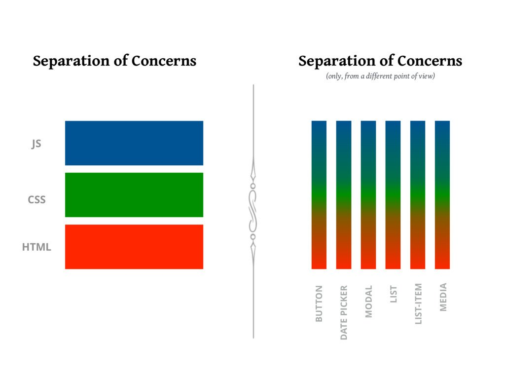

The classic approach to styling in the browser is creating a
css file and provide it with a `<link />` tag. The tutorial
from last session also worked with an external css file, but
linked it by adding a JS `import` statement. The benefits of
this way are an easy separation of concerns and the already
known workflow of styling html elements.

But the separation of concerns also leads to another path.
In react an application is separated into components, but
the workflow of defining global style-classes is quiet
contrary. So why not rethink it?

[Christiano Rastelli](https://twitter.com/areaweb) made this
wonderful graphic, which shows a new way of drawing
boundaries in a component oriented application architecture.

